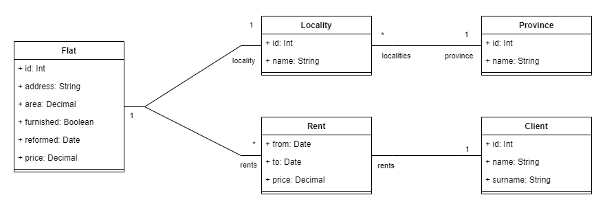

# spring-class-project-5

_Búsquedas avanzadas e informes_

## 1. Introducción

Este proyecto es una implementación libre de un servicio web que genera informes para una agencia inmobiliaria.

## 2. Objetivo

El objetivo es construir una API sobre Spring Boot que permita generar una serie de informes a partir de la información almacenada en una base de datos. Así pues, el proyecto creará uno o varios controladores que al ser invocados con los parámetros adecuados, devolverán el informe solicitado.

Este proyecto puede resolverse de dos maneras. Por un lado, obteniendo toda la información de la base de datos a traves de las entidades/repositorios, luego filtrando y agrupando en el servicio, y finalmente devolviendo el resultado del informe. Por otro, se puede resolver haciendo uso de las capacidades avanzadas de JPA/Hibernate:
- [Criteria Queries](https://www.baeldung.com/hibernate-criteria-queries), que permiten modelar idiomáticamente una consulta usando las propiedades de las entidades.
- [Native queries](https://thorben-janssen.com/jpa-native-queries/), que permiten ejecutar directamente SQL y mapear los resultados sobre una entidad o clase.

**Se recomienda comenzar por el primer enfoque y una vez entendida la dimensión del problema, proceder con el segundo.**

## 3. Especificación

### 3.1 Informes

Un informe es una colección de registros con una serie de campos determinados. Los diferentes campos, el número de tuplas y la información de cada uno depende de la naturaleza de cada informe. 

Se espera que los controladores permitan la obtención de cuatro informes diferentes: listado de contratos; informe de superficie alquilada por provincia; precio medio del alquiler por provincia; variación del precio de los inmuebles sobre el precio medio de la provincia. 

Todos los informes tendrán los mismos parámetros de entrada:
- **Nombre de provincia**: permitirá filtrar los resultados cuya provincia coincida parcialmente con el texto indicado
- **Fecha de inicio y fin**: dado que todos los informes participan de la entidad **alquiler**, estos campos permiten acotar qué resultados deberán incluirse en el listado

#### 3.1.1 Informe completo de alquileres

Este informe muestra toda la información de los contratos registrados en la agencia inmobiliaria en un periodo dado. Los campos que deben mostrarse son:
- Identificador del inmueble
- Dirección del inmueble
- Nombre completo del inquilino
- Fecha de inicio del contrato
- Fecha de fin del contrato
- Nombre de la localidad
- Nombre de la provincia

Ejemplo orientativo
``` 
GET /reports/allRents?from=2023-12-01&to=2024-02-01
[
    {
        "flatId":1,
        "street":"Calle de la Alameda 1, Escalera 3.",
        "client":"Javier Fernandez Gutierrez",
        "from":"2024-01-01",
        "to":"2025-05-01",
        "province":"Sevilla",
        "locality":"Dos Hermanas"
    },
    ...
]
```
#### 3.1.2 Informe de superficie alquilada por provincia

Este informe refleja el número total de metros cuadrados dedicados al alquiler en una provincia determinada. El número total de metros cuadrados se obtiene como la suma de los metros cuadrados de todas las viviendas alquiladas en el periodo indicado, agrupados por provincia. La información que debe mostrarse es:
- Nombre de la provincia
- Número de inmuebles
- Superficie total alquilada (metros cuadrados)


Ejemplo orientativo
``` 
GET /reports/rentedSurfaceByProvince?from=2023-12-01&to=2024-02-01
[
    {
        "totalSurface":15432,
        "totalFlats":512,
        "province":"Córdoba",
    },{
        "totalSurface":44332,
        "totalFlats":865,
        "province":"Valencia",
    },
    ...
]
```

#### 3.1.3 Precio medio del alquiler por provincia

Este informe visualiza el precio promedio que tienen todas las viviendas alquiladas en cada provincia. El precio medio se obtiene sumando el importe de todos los alquileres de cada provincia y luego dividiéndolo entre el total de alquileres en el periodo indicado.

La información que debe mostrarse es:
- Nombre de la provincia
- Precio medio del alquiler (en euros)


Ejemplo orientativo
``` 
GET /reports/averagePriceByProvince?from=2023-12-01&to=2024-02-01
[
    {
        "province":"Cádiz",
        "averagePrice":6543.21,
    },
    ...
]
```
#### 3.1.4 Variación del precio de un alquiler respecto al precio medio de la provincia

Este informe permite ver cuanto más caro o barato es un alquiler con respecto al resto de alquileres de su provincia durante el periodo indicado. La variacion se consigue dividiendo el precio de un alquiler entre el valor medio de los alquileres de la provincia donde se encuentra para el periodo indicado.

La información que debe mostrarse es:
- Identificador de la vivienda
- Dirección
- Provincia
- Población
- Precio del alquiler
- Precio medio en la provincia
- Variación del precio del alquiler inmueble respecto al precio medio de la provincia (en %)

Ejemplo orientativo
``` 
GET /reports/priceVariationFromAverageByProvince?from=2023-12-01&to=2024-02-01
[
    {
        "flatId":55543,
        "street":"Paseo de la Castellana 321, 10º A",
        "province":"Madrid",
        "locality":"Madrid",
        "flatPrice": 1500,
        "averagePrice":1320,
        "variation": 0.1363 // 13.63%
    },
    ...
]
```

> **Este informe no es trivial y requiere de consultas SQL anidadas**

### 3.2. Esquema de base de datos

La base de datos contiene datos ficticios sobre una empresa de alquiler de inmuebles. Las entidades de las que registra información son las siguientes:
- Municipios (_localities_): La lista completa de municipios obtenida del INE. 
    - id: Identificador del municipio
    - province_id: Identificador de la provincia a la que pertenece
    - name: Nombre del municipio
- Provincias (_provinces_): Lista completa de provincias según el INE.
    - id: Identificador de la provincia
    - name: Nombre de la provincia
- Clientes (_clients_): Lista de personas que tienen o han tenido un piso en alquiler
- Pisos (_flats_): Lista de pisos que estan o han estado alquilados.
    - id: Identificador único del piso
    - locality_id: Identificador de la localidad donde se encuentra el inmueble
    - address: Dirección del inmueble
    - area: Superficie del piso, especificada en metros cuadrados
    - furnished: Determina si el piso está amueblado o no
    - reformed: Fecha (opcional) en la que el piso fue reformado por última vez
    - price: Precio del piso
- Contratos de alquiler (_rents_): Información del contrato por el que un cliente alquila un piso durante un periodo determinado.
    - id: Identificador del contrato
    - flat_id: Identificador del piso que se alquila
    - client_id: Identificador del inquilino
    - from: Fecha de inicio del contrato
    - to: Fecha de fin del contrato
    - price: Precio mensual que abonará el inquilino

### 3.3 Asociación de entidades

Aunque la organización de la jerarquía de entidades es libre, a continuación se detallan algunas relaciones que se derivan del esquema relacional empleado en la base de datos:

- Una **provincia** puede estar vinculada con múltiples **localidades**
- Una **localidad** está vinculada a una única **provincia**
- Una **localidad** puede estar asociada con muchos **pisos**
- Cada **piso** está ubicado en una única **localidad**
- Cada **piso** puede estar presente en uno o varios **alquileres**, pero solo en uno a la vez en cada periodo
- Cada **alquiler** está asociado a un único **piso**
- Cada **alquiler** está asociado con un único **cliente**
- Cada **cliente** puede estar asociado con varios **alquileres**, pero solo con uno en cada periodo


## 4. Organización del código y decisiones de diseño

Este proyecto es un ejercicio completamente libre:

- Se puede crear un único controlador o varios
- El número de servicios queda a criterio del programador
- Los repositorios se crearán según sean necesarios
- Las entidades se crearán según las necesidades de la aplicación y la información de la base de datos
- Los DTOs, los nombres de las clases, atributos, variables y demás son de libre elección siempre y cuando los informes muestren la información requerida.

## 5. Relación de actividades

1. Crear la base de datos e importar los datos desde el script sql proporcionado.
2. Modelar las entidades a partir de las tablas proporcionadas
3. Definir los repositorios necesarios
4. Modelar los servicios y DTOs que devuelvan los informes solicitados
5. Crear los controladores apropiados que invoquen a los servicios y devuelvan la información
6. Verificar el resultado de los controladores y el buen funcionamiento de los filtros

## 6. Bibliografía

- [Spring Data JPA @Query](https://www.baeldung.com/spring-data-jpa-query)
- [JPA Query Methods](https://docs.spring.io/spring-data/jpa/reference/jpa/query-methods.html)
- [Is your query too complex for JPA and Hibernate?](https://thorben-janssen.com/query-complex-jpa-hibernate/#5-use-subqueries-in-the-where-and-having-clause)